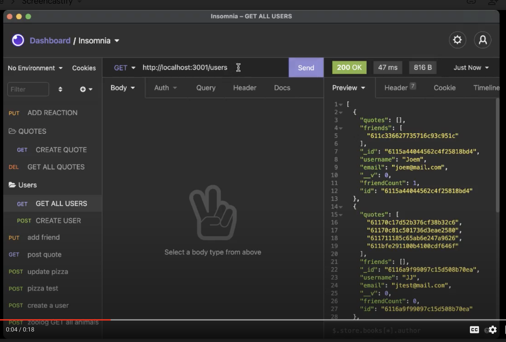

# social-quotes

## **Description**
API for a social network web application where users can share quotes, react to friends’ quotes, and create a friend list. 

## **Table of Contents**
* [Installation](#installation)
* [Usage](#usage)
* [Contributions](#contributions)
* [Licenses](#licenses)
* [Badges](#Badges)
* [Questions](#questions)

### **Installation**
install dependencies:

npm
Mongoose
Express

Install the necessary dependencies run the following command: npm i, npm i express, npm i mongoose

### **Usage**
⏯
This is a Backend application

[Demo for Application](https://drive.google.com/file/d/1emyGOOnq7symExm1PRjddYBwZLnM0PJ4/view?usp=sharing)

### **Technologies Used:**

* JavaScript
* npm
* MongoDB
* Express
* Mongoose

### *Contributions*

### *Licenses*
MIT license

### *Badges*

### *Questions*
If you have any questions, reach out to me on Git Hub https://github.com/JJLindsey, or send me a message jlindsey010@gmail.com.

©Jennifer Lindsey 2021
